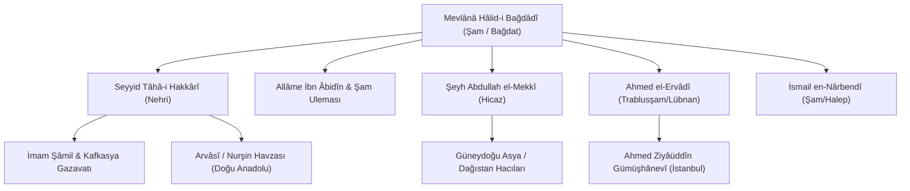

# 19. Yüzyıl Osmanlı ve İslâm Dünyasında Hâlidiyye’nin Sosyo-Politik ve Dinî Dönüşümü

19. yüzyılın başları, Osmanlı İmparatorluğu ve genel olarak İslâm âlemi açısından askerî ric'atlerin, Batılılaşma baskılarının, iç isyanların ve idari reformların yaşandığı son derece çalkantılı bir döneme tekabül eder. Mevlânâ Hâlid-i Bağdâdî'nin (1779–1827) başlattığı Hâlidiyye hareketi, bu kriz çağında hem toplumsal tabakaları hem ulemayı hem de devlet idaresini derinden etkileyen muazzam bir mânevî ve içtimaî tecdid dalgası meydana getirmiştir.

---

## 1. 19. Yüzyıl Başlarında Genel Manzara ve Tecdid İhtiyacı

* **Vahhâbî Hareketi ve Hicaz Krizleri:** Necid bölgesinde ortaya çıkan Vahhâbîlik, Mekke ve Medine'yi ele geçirerek Ehl-i Sünnet tasavvuf ve türbe kültürünü şiddetle hedef almıştı.
* **Osmanlı Merkezî Otoritesinin Zayıflaması:** Âyanların güçlenmesi, yerel beylerin isyanları ve bürokrasideki yozlaşma iç bütünlüğü sarsmaktaydı.
* **Medrese-Tekke Yabancılaşması:** Bazı tekkelerin şer'î sınırlardan uzaklaşması ve bazı medreselerin kuru taassuba saplanması ilim-irfan dengesini bozmuştu.

Mevlânâ Hâlid, bu ahval içerisinde sünnete bağlılık, medrese-tekke birliği ve siyasi istikrarı koruma prensipleriyle sahneye çıkmıştır.

---

## 2. II. Mahmud Dönemi, Yeniçeri Ocağının İlgası ve Hâlidîlik

1826 senesinde Sultan II. Mahmud tarafından Yeniçeri Ocağı'nın kaldırılması (Vak'a-i Hayriyye), Osmanlı'da yalnızca askerî bir değişim değil, köklü bir zihniyet ve tarikat dönüşümü doğurmuştur:

* **Bektaşîliğin Yasaklanması:** Yeniçerilikle organik bağı olan Bektaşî tekkeleri kapatılmış ve mallarına el konulmuştur.
* **Hâlidîliğin Yükselişi:** Devlet ricali, ulema ve halk kitleleri nezdinde şeriata tavizsiz bağlılığı, Ehl-i Sünnet hassasiyeti ve disiplinli yapısıyla temayüz eden Nakşibendî-Hâlidî ekolü, imparatorluğun mânevî dayanak noktası haline gelmiştir.
* **İstanbul Dergâhları:** Hâlidî meşâyihi (Ahmed Ziyâüddîn Gümüşhânevî, İsmail en-Nârbendî hattı, Yahyâ el-Mervezî, Beşiktaşlı Yahyâ Efendi vb.) Osmanlı payitahtında bürokratlar, zabitler ve ilmiye sınıfı üzerinde büyük bir nüfuz tesis etmiştir.

---

## 3. Coğrafi Yayılım ve Ağ Yapısı

Hâlidiyye ekolü, tarihte benzeri az görülen bir hız ve organizasyon kabiliyetiyle üç kıtaya yayılmıştır:

---

## 4. Kafkasya Direnişi ve Müridizm Hareketi

Hâlidiyye ekolünün Doğu Anadolu ve Kafkasya'daki en mühim meyvelerinden biri, Rus Çarlığı'nın yayılmacılığına karşı yürütülen **Gazavat (Müridizm)** hareketidir:

* Seyyid Tâhâ-i Hakkârî ve Şeyh Şâmil'in mürşidi Şeyh Şamil'in Hâlidî şeyhleriyle olan rabıtası, Kafkas halklarının onlarca yıl süren bağımsızlık mücadelesinin mânevî mayasını oluşturmuştur.
* Cihad ve takvayı mezceden bu anlayış, hem nefisle büyük cihadı (seyr u sülûk) hem de vatan müdafaasındaki küçük cihadı birlikte ifa etmiştir.

---

## 5. Kültürel ve İlmî Miras

Hâlidiyye; matbaanın tasavvufî eserler neşrinde kullanılmasından medreselerde mantık ve fıkıh ıslahına, vakıf kütüphanelerinin zenginleştirilmesinden toplumsal dayanışma sandıklarına kadar pek çok alanda modern öncesi İslâm dünyasının en canlı ıslahat ve diriliş dinamosu olmuştur.
