# Nakşibendiyye-Hâlidiyye Silsile-i Aliyyesi (Altın Zincir)

Hâlidiyye yolu, İslâm tasavvuf tarihinin en köklü ve şeriata en tavizsiz bağlı silsilelerinden biri olan **Silsile-i Aliyye (Altın Silsile)** üzerinden Resûlullah (sallâllâhu aleyhi ve sellem) Efendimiz'e ve Hz. Ebû Bekir Sıddîk (r.a.) Efendimiz'e dayanır.

---

## 1. Altın Silsilenin Tarihî Merhaleleri

Nakşibendî silsilesi tarih boyunca dört büyük tecdid dönemi geçirmiştir:
1. **Sıddîkıyye / Tayfûriyye:** Hz. Ebû Bekir Sıddîk (r.a.) ve Bâyezîd-i Bistâmî (k.s.) dönemi.
2. **Hâcegâniyye:** Hâce Abdülhâlik-ı Gucdüvânî (k.s.) ve Şâh-ı Nakşibend Muhammed Bahâeddin (k.s.) dönemi.
3. **Müceddidiyye:** İmam-ı Rabbânî Müceddid-i Elf-i Sânî Ahmed Fârûkī es-Serhendî (k.s.) dönemi.
4. **Hâlidiyye:** Mevlânâ Ziyâüddîn Hâlid-i Bağdâdî eş-Şehrezûrî (k.s.) dönemi.

---

## 2. Mevlânâ Hâlid-i Bağdâdî'ye Ulaşan 30 Mürşid

```mermaid
flowchart TD
    N1["1. Fahr-i Kâinât Hz. Muhammed Mustafâ (s.a.v.)"] --> N2["2. Hz. Ebû Bekir Sıddîk (r.a.)"]
    N2 --> N3["3. Selmân-ı Fârisî (r.a.)"]
    N3 --> N4["4. Kāsım b. Muhammed b. Ebî Bekir (r.a.)"]
    N4 --> N5["5. İmâm Câ'fer-i Sâdık (r.a.)"]
    N5 --> N6["6. Bâyezîd-i Bistâmî (k.s.)"]
    N6 --> N7["7. Ebü'l-Hasan el-Harakānî (k.s.)"]
    N7 --> N8["8. Ebû Ali el-Fârmedî (k.s.)"]
    N8 --> N9["9. Yûsuf el-Hemedânî (k.s.)"]
    N9 --> N10["10. Abdülhâlik-ı Gucdüvânî (k.s.)"]
    N10 --> N11["11. Ârif-i Rîvegerî (k.s.)"]
    N11 --> N12["12. Mahmûd İncîr-Fagnevî (k.s.)"]
    N12 --> N13["13. Ali Râmîtenî (k.s.)"]
    N13 --> N14["14. Muhammed Bâbâ Semmâsî (k.s.)"]
    N14 --> N15["15. Emîr Külâl (k.s.)"]
    N15 --> N16["16. Şâh-ı Nakşibend Muhammed Bahâeddin (k.s.)"]
    N16 --> N17["17. Alâüddin Attâr (k.s.)"]
    N17 --> N18["18. Yâkūb-i Çerhî (k.s.)"]
    N18 --> N19["19. Hâce Ubeydullāh-ı Ahrâr (k.s.)"]
    N19 --> N20["20. Muhammed Zâhid (k.s.)"]
    N20 --> N21["21. Derviş Muhammed (k.s.)"]
    N21 --> N22["22. Hâcegî Emkenekî (k.s.)"]
    N22 --> N23["23. Muhammed Bâkī-Billâh (k.s.)"]
    N23 --> N24["24. İmam-ı Rabbânî Müceddid-i Elf-i Sânî (k.s.)"]
    N24 --> N25["25. Muhammed Ma'sûm Fârûkī (k.s.)"]
    N25 --> N26["26. Şeyh Seyfeddin Ârif (k.s.)"]
    N26 --> N27["27. Seyyid Nûr Muhammed Bedâyûnî (k.s.)"]
    N27 --> N28["28. Şemseddin Mazhar Cân-ı Cânân (k.s.)"]
    N28 --> N29["29. Şâh Abdullah ed-Dehlevî (Şâh Gulâm Ali) (k.s.)"]
    N29 --> N30["30. Mevlânâ Ziyâüddîn Hâlid-i Bağdâdî (k.s.)"]
```

---

## 3. Silsile-i Aliyye Tablosu ve Detaylı Kronoloji

| No | İsim | Vefat Yılı / Hicrî | Kabr-i Şerîf / Şehir | Tecdid / Hizmet Dönemi |
| :--- | :--- | :--- | :--- | :--- |
| **1** | **Hz. Muhammed Mustafâ (s.a.v.)** | 11 H. (632 M.) | Medîne-i Münevvere | Nübüvvet ve Risâlet Menbaı |
| **2** | **Hz. Ebû Bekir Sıddîk (r.a.)** | 13 H. (634 M.) | Medîne-i Münevvere | Hafî zikir ve Sıddîkıyyet |
| **3** | **Selmân-ı Fârisî (r.a.)** | 35 H. (656 M.) | Medâin (Irak) | Ehl-i Beyt muhabbeti |
| **4** | **Kāsım b. Muhammed (r.a.)** | 106 H. (724 M.) | Kudeyd / Medîne | Fukahâ-i Seb'a reisi |
| **5** | **İmâm Câ'fer-i Sâdık (r.a.)** | 148 H. (765 M.) | Medîne (Cennetü'l-Baki') | Zâhir ve bâtın ilimleri vahdeti |
| **6** | **Bâyezîd-i Bistâmî (k.s.)** | 261 H. (875 M.) | Bistam (İran) | Fenâfillâh ve Tayfûriyye |
| **7** | **Ebü'l-Hasan Harakānî (k.s.)** | 425 H. (1034 M.) | Kars / Harakān | Fütüvvet ve ihlas mektebi |
| **8** | **Ebû Ali Fârmedî (k.s.)** | 477 H. (1084 M.) | Tûs (İran) | Gazzâlî ve Kuşeyrî muhiti |
| **9** | **Yûsuf el-Hemedânî (k.s.)** | 535 H. (1140 M.) | Merv (Türkmenistan) | Mâverâünnehir pîri |
| **10** | **Abdülhâlik-ı Gucdüvânî (k.s.)** | 575 H. (1179 M.) | Gucdüvân (Buhara) | 11 Kelimât-ı Kudsiyye tesisçisi |
| **11** | **Ârif-i Rîvegerî (k.s.)** | 616 H. (1219 M.) | Rîveger (Buhara) | Hâcegân irşadı |
| **12** | **Mahmûd İncîr-Fagnevî (k.s.)** | 715 H. (1315 M.) | Vâbkent (Buhara) | Zikir ve cehd mektebi |
| **13** | **Ali Râmîtenî (Hazret-i Azîzân) (k.s.)** | 721 H. (1321 M.) | Hârezm | Sanat ve zühd tevhidi |
| **14** | **Muhammed Bâbâ Semmâsî (k.s.)** | 755 H. (1354 M.) | Semmâs (Buhara) | Şâh-ı Nakşibend'i müjdeleyen |
| **15** | **Seyyid Emîr Külâl (k.s.)** | 772 H. (1370 M.) | Sûhârî (Buhara) | Şâh-ı Nakşibend'in mürşidi |
| **16** | **Şâh-ı Nakşibend Bahâeddin (k.s.)** | 791 H. (1389 M.) | Kasr-ı Ârifân (Buhara) | Nakşibendiyye pîri |
| **17** | **Alâüddin Attâr (k.s.)** | 802 H. (1400 M.) | Çagāniyân (Özbekistan) | Râbıta ve muhabbet kutbu |
| **18** | **Yâkūb-i Çerhî (k.s.)** | 851 H. (1447 M.) | Halfetû (Tacikistan) | Tefsir ve tevhîd müellifi |
| **19** | **Hâce Ubeydullāh-ı Ahrâr (k.s.)** | 895 H. (1490 M.) | Semerkand | Devlet-cemiyet irşad rehberi |
| **20** | **Muhammed Zâhid Vahşî (k.s.)** | 936 H. (1529 M.) | Hısâr (Tacikistan) | Zühd ve amel-i sâlih |
| **21** | **Derviş Muhammed (k.s.)** | 970 H. (1562 M.) | Asfencâr (Semerkand) | İstiğnâ ve takva timsali |
| **22** | **Hâcegî Muhammed Emkenekî (k.s.)** | 1008 H. (1599 M.) | Emkene (Buhara) | Hindistan kapısını açan |
| **23** | **Muhammed Bâkī-Billâh (k.s.)** | 1012 H. (1603 M.) | Delhi (Hindistan) | Hindistan feyiz menbaı |
| **24** | **İmam-ı Rabbânî Müceddid-i Elf-i Sânî (k.s.)** | 1034 H. (1624 M.) | Serhend (Hindistan) | İkinci Bin Yılın Müceddidi |
| **25** | **Muhammed Ma'sûm Fârûkī (k.s.)** | 1079 H. (1668 M.) | Serhend (Hindistan) | Urvetü'l-Vüskā |
| **26** | **Şeyh Seyfeddin Ârif (k.s.)** | 1096 H. (1684 M.) | Serhend (Hindistan) | Muhyî-i Sünnet |
| **27** | **Seyyid Nûr Muhammed Bedâyûnî (k.s.)** | 1135 H. (1723 M.) | Delhi (Hindistan) | Helal lokma ve takva kutbu |
| **28** | **Şemseddin Mazhar Cân-ı Cânân (k.s.)** | 1195 H. (1781 M.) | Delhi (Hindistan) | Şehîd-i Aşk ve şair |
| **29** | **Şâh Abdullah ed-Dehlevî (k.s.)** | 1240 H. (1824 M.) | Delhi (Cihânâbâd) | Mevlânâ Hâlid'in mürşidi |
| **30** | **Mevlânâ Ziyâüddîn Hâlid-i Bağdâdî (k.s.)** | 1242 H. (1827 M.) | Şam (Kāsiyûn / Sâlihiye) | Hâlidiyye Müceddidi |

---

## 4. Hâlidiyye Silsilesinin Özellikleri

1. **İttisâl-i Tâmm (Kusursuz Kesintisizlik):** Silsiledeki her bir halka, bir önceki zâttan bizzat zâhirî icazet ve bâtınî tasarruf alarak yetiştirilmiştir.
2. **Fıkhî Derinlik:** Silsile ricalinin tamamı aynı zamanda devirlerinin fıkıh, tefsir, hadis ve kelâm allâmeleridir.
3. **Sünnet-i Seniyye Omurgası:** Bid'atlerden ve şeriata mugayir taşkınlıklardan tamamen tecrit edilmiş bir zikir disiplinidir.
